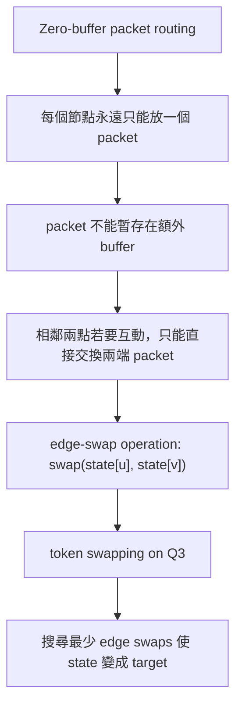
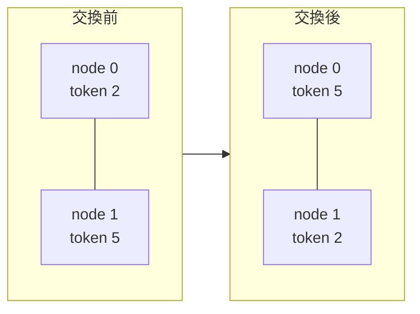

# Q3 Hypercube Token Swapping: 搜尋方法詳細介紹

本文件整理本專案在 Q3 hypercube token swapping / zero-buffer edge-swap routing 問題中實際使用的方法。內容以可讀性與可檢查性為主，說明每個方法的目的、流程、公式、參數意義、最短性保證與限制。

## 從 Zero-buffer Edge-swap Routing 到本專案的實作問題

這一段先說明本專案如何把「zero-buffer routing」轉換成程式可以處理的 token swapping 問題。這個轉換是整個專案最抽象的部分，因為 routing 原本聽起來像是封包在網路中移動，但程式中看到的是 permutation、state、edge swap 和 search。

### A. Routing 觀點：節點是 router，token 是 packet

在 routing 的語境中，可以把 Q3 hypercube 看成一個小型網路：

- 每個節點是一台 router。
- 每個 token 是一個 packet。
- token `i` 的目的地是 node `i`。
- 初始狀態表示每個 router 目前拿到哪一個 packet。
- 目標是讓所有 packet 都回到自己的目的地。

例如：

```text
state = (2, 1, 4, 0, 3, 5, 6, 7)
```

代表：

```text
node 0 上有 token 2
node 1 上有 token 1
node 2 上有 token 4
node 3 上有 token 0
node 4 上有 token 3
node 5 上有 token 5
node 6 上有 token 6
node 7 上有 token 7
```

其中 token `2` 的目的地是 node `2`，token `4` 的目的地是 node `4`，token `0` 的目的地是 node `0`，依此類推。

### B. Zero-buffer 的限制是什麼

Zero-buffer 的意思是：節點沒有額外暫存空間。

也就是說，每個 node 在任何時刻都只能放一個 token。不能出現下面這種情況：

```text
node u 原本有 token A
node v 原本有 token B

把 token A 移到 node v
但 token B 暫時留在 node v 或放到額外 buffer
```

這在 zero-buffer 模型中不合法，因為 node `v` 會同時有兩個 token，或者需要額外 buffer 暫存 token `B`。

因此，如果兩個相鄰節點要交換資訊，最自然且合法的 local operation 就是「直接交換兩端 token」：

```text
node u: token A        node u: token B
node v: token B   ->   node v: token A
```

這個操作不需要空節點，也不需要額外 buffer。交換前後，每個節點仍然剛好只有一個 token。

### C. 為什麼變成 edge-swap

Q3 hypercube 的邊代表哪些 router 可以直接通訊。

如果 `(u, v)` 是 Q3 的合法邊，表示 node `u` 和 node `v` 相鄰，可以直接交換 token。若兩個節點不是相鄰，就不能在一步內直接交換。

因此 zero-buffer routing 在本專案中被轉成下列操作：

```text
選一條 Q3 合法邊 (u, v)
交換 state[u] 和 state[v]
```

也就是：

```text
next_state[u] = state[v]
next_state[v] = state[u]
其他 node 不變
```

參數與變數意義：

- `state`：目前整個網路的 token 配置。
- `u`：本次選擇交換的邊的一端。
- `v`：本次選擇交換的邊的另一端。
- `state[u]`：交換前 node `u` 上的 token。
- `state[v]`：交換前 node `v` 上的 token。
- `next_state`：交換後的新配置。

### D. 轉換流程圖

下面的圖表示原本的 routing 問題如何轉換成程式中的搜尋問題。



這個轉換的重點是：我們不是在允許 packet 任意移動，而是把 zero-buffer 的限制落實成「每一步只能沿著一條合法邊交換兩端 token」。

### E. Edge swap 前後示意

以下示意只展示一條邊 `(0, 1)` 的交換規則。假設交換前：

```text
node 0 上有 token 2
node 1 上有 token 5
```

沿 edge `(0, 1)` 做一次 swap 後：

```text
node 0 上有 token 5
node 1 上有 token 2
```



交換前後都滿足 zero-buffer 條件：

- node `0` 始終只有一個 token。
- node `1` 始終只有一個 token。
- 沒有 token 被放到額外 buffer。
- 沒有節點同時保存兩個 token。

### F. 程式中的狀態為什麼是 permutation

因為 Q3 有 8 個 node，也有 8 個 token，而且每個 node 恰好放一個 token，所以整個狀態可以表示成一個 permutation：

```text
state[node] = token
```

例如：

```text
state = (2, 1, 4, 0, 3, 5, 6, 7)
```

這是一個 permutation，因為 token `0..7` 各出現一次，不會重複也不會缺少。

目標狀態是 identity permutation：

```text
target = (0, 1, 2, 3, 4, 5, 6, 7)
```

也就是：

```text
state[i] = i for every node i
```

### G. 為什麼可以用 graph search 求解

一旦把 routing state 寫成 permutation，每一個 permutation 就可以看成搜尋圖中的一個節點。

若兩個 permutation 可以透過一次合法 edge swap 互相轉換，則它們之間有一條搜尋圖上的邊。

因此原問題變成：

```text
在 permutation state graph 中，
從 initial_state 找到 target_state 的最短路徑。
```

其中：

- 搜尋圖的節點：所有 `8! = 40320` 個 permutation。
- 搜尋圖的邊：一次 Q3 合法 edge swap。
- 邊成本：每次 swap 成本為 `1`。
- 最短路徑長度：最少 edge swaps 次數。

這就是為什麼可以使用 BFS、A*、Beam Search 等搜尋方法。

### H. 本專案採用的是 sequential edge-swap count

Zero-buffer routing 有時也會研究「多條不相交邊同時交換」的 parallel routing round。不過本專案的目標是最少交換次數，而不是最少 parallel rounds。

因此本專案採用 sequential edge-swap model：

```text
每一步只選一條合法邊做 swap
總成本 = swap 次數
```

這和程式輸出的 `steps` 或 `swaps` 對應。

如果一個解的路徑是：

```text
01 13 37
```

表示依序做三次交換：

```text
第 1 步：swap edge 01
第 2 步：swap edge 13
第 3 步：swap edge 37
```

所以這個 routing path 的成本是 `3`。

### I. 轉換後的正式問題

整理後，本專案實作的問題可以寫成：

```text
Input:
    一個 Q3 上的 permutation state

Operation:
    每一步選一條 Q3 合法邊 (u, v)
    交換 state[u] 和 state[v]

Target:
    state = (0, 1, 2, 3, 4, 5, 6, 7)

Objective:
    minimize number of edge swaps
```

因此，zero-buffer edge-swap routing 在本專案中等價於 Q3 上的 minimum token swapping 問題。

## 1. 問題模型與符號

本專案研究的是三維超立方體 `Q3` 上的 token swapping 問題。

### 1.1 圖形與狀態

- `Q3`：3-dimensional hypercube。
- `DIM = 3`：hypercube 的維度。
- `NODE_COUNT = 2^DIM = 8`：節點數。
- 節點編號：`0..7`，每個節點可視為 3-bit binary label。
- 合法邊：若兩個節點的 binary label 只差一個 bit，則兩者相鄰。
- `state[node] = token`：表示某個節點上目前放著哪一個 token。
- `target_state = (0, 1, 2, 3, 4, 5, 6, 7)`：目標狀態，token `i` 要回到 node `i`。

Q3 的合法邊共 12 條：

```text
01, 02, 04,
13, 15,
23, 26,
37,
45, 46,
57,
67
```

每一次操作只能選一條合法邊 `(u, v)`，交換該邊兩端的 token：

```text
swap(state[u], state[v])
```

其中：

- `u`：邊的一端節點。
- `v`：邊的另一端節點。
- `state[u]`：節點 `u` 上目前的 token。
- `state[v]`：節點 `v` 上目前的 token。

此模型符合 zero-buffer routing，因為每個節點始終只保存一個 token，沒有額外暫存空間，也不允許 token 堆疊。

### 1.2 最佳化目標

給定任意初始 permutation `s0`，目標是找到最短的 edge-swap 序列：

```text
e1, e2, ..., ek
```

使得連續套用這些 swap 後到達目標狀態，並讓 `k` 最小。

其中：

- `ei`：第 `i` 次交換使用的 Q3 合法邊。
- `k`：交換總步數。
- 最佳解：所有可行交換序列中 `k` 最小的序列。

本專案對 Q3 做 full permutation 測試，也就是所有 `8! = 40320` 個初始狀態都會被測試。

## 2. 方法總覽

本專案使用五種方法或基準：

| 方法 | 類型 | 是否保證最短 | 主要用途 |
|---|---|---:|---|
| BFS | exact exhaustive search | 是 | 建立 true table / ground truth |
| Basic A* | exact heuristic search | 是 | 使用簡單 admissible heuristic 加速搜尋 |
| Strong A* | exact heuristic search | 是 | 使用更強 lower bound 減少搜尋量 |
| Beam Search | heuristic search | 否 | 快速搜尋，測試剪枝式方法的效果 |
| Batcher baseline | deterministic sorting network | 否 | 固定規則 baseline，不追求最短 |

在 Q3 full permutation 實驗中：

- BFS 用來產生每個 state 的正確最短步數。
- Basic A* 與 Strong A* 都是 exact A*，結果與 BFS 完全一致。
- Beam Search 理論上不保證最短，但在 Q3 全測中與 BFS 完全一致。
- Batcher baseline 能排序所有狀態，但大多不是最短解。

## 3. BFS True Table

### 3.1 方法目的

BFS（Breadth-First Search）在本專案中的角色是建立 true table。

所謂 true table，是指對每一個 permutation 都記錄它到 target state 的真正最短交換步數。

### 3.2 核心流程

BFS 從初始狀態開始，按照交換步數逐層展開：

```text
深度 0：初始狀態
深度 1：交換 1 次可到達的所有狀態
深度 2：交換 2 次可到達的所有狀態
...
```

每個狀態都會嘗試所有 Q3 合法邊：

```text
for edge (u, v) in Q3_edges:
    next_state = swap_nodes(state, u, v)
```

參數與變數意義：

- `Q3_edges`：Q3 的 12 條合法邊。
- `edge (u, v)`：目前嘗試的交換邊。
- `state`：目前正在展開的 permutation。
- `next_state`：沿 `(u, v)` 交換後的新 permutation。
- `swap_nodes(state, u, v)`：交換 `state[u]` 和 `state[v]` 的操作。

如果 `next_state` 尚未被拜訪過，就把它加入 queue，並記錄它的深度。

### 3.3 使用的資料結構

BFS 主要使用兩個資料結構：

```text
queue<pair<state, depth>> q
visited set
```

參數與變數意義：

- `q`：待展開的狀態佇列。
- `state`：一個 permutation。
- `depth`：從初始狀態走到該 state 已使用的 swap 次數。
- `visited`：已經看過的 state 集合。

`visited` 的作用是避免重複搜尋。例如：

```text
swap 01
swap 01
```

這兩步會回到原狀，如果沒有 `visited`，搜尋會不斷重複繞圈。

### 3.4 最短性保證

BFS 能保證最短，原因是：

1. 每次 edge swap 的 cost 都是 `1`。
2. BFS 依照 `depth = 0, 1, 2, ...` 的順序展開。
3. 第一次到達 target 時，所有更小 depth 的狀態都已經被檢查過。

因此 BFS 第一次找到 target 的深度，就是最少交換步數。

### 3.5 優點與限制

優點：

- 保證找到最短解。
- 適合作為 correctness baseline。
- Q3 狀態數只有 `40320`，可以完整跑完。

限制：

- 狀態數隨節點數快速成長。
- Q4 有 `16!` 個 permutation，完整 BFS 不實際。
- 不適合作為高維度問題的主要求解器。

## 4. Basic A*

### 4.1 方法目的

Basic A* 的目標是在保證 optimal 的前提下，比 BFS 更快找到 target。

BFS 只看目前已花費步數；A* 則同時考慮目前成本與對剩餘成本的估計。

### 4.2 A* 評分公式

A* 對每個候選狀態計算：

```text
f(state) = g(state) + h(state)
```

參數與變數意義：

- `state`：目前候選 permutation。
- `g(state)`：從初始狀態走到 `state` 已經用了幾次 swap。
- `h(state)`：估計從 `state` 到 target 至少還需要幾次 swap。
- `f(state)`：目前路徑總成本的樂觀估計。

A* 每次從 priority queue 中取出 `f` 最小的狀態展開。

如果兩個狀態的 `f` 相同，本專案會再比較：

```text
h 較小者優先
若 h 也相同，g 較小者優先
```

### 4.3 Basic heuristic 公式

Basic A* 使用：

```text
h_basic(state) = ceil(total_hamming_distance(state) / 2)
```

參數與變數意義：

- `h_basic(state)`：Basic A* 對剩餘步數的 lower bound。
- `total_hamming_distance(state)`：所有 token 到各自目標位置的 Hamming distance 總和。
- `ceil(x)`：向上取整，因為交換次數必須是整數。
- 分母 `2`：因為一次 swap 最多讓兩個 token 各自靠近目標一步，所以總距離最多下降 2。

Hamming distance 的意思是兩個 binary label 中不同 bit 的數量。

例如 token `6 = 110` 目前在 node `0 = 000`：

```text
HammingDistance(000, 110) = 2
```

代表 token 6 至少要修正兩個 bit 才能回到自己的目標節點。

### 4.4 為什麼 Basic heuristic 不會高估

令：

```text
D = total_hamming_distance(state)
```

一次合法 edge swap 最多讓 `D` 下降 2。因此若目前總距離是 `D`，剩餘最少交換次數至少是：

```text
ceil(D / 2)
```

所以：

```text
h_basic(state) <= 真正剩餘最短步數
```

這就是 admissible heuristic 的條件。只要 heuristic admissible，A* 正常終止時就能保證 optimal。

### 4.5 使用的資料結構

Basic A* 使用：

```text
priority_queue<AStarNode> pq
unordered_map<state, best_g>
```

參數與變數意義：

- `pq`：依照 `f = g + h` 排序的 priority queue。
- `AStarNode`：queue 中的節點，包含 `f`, `h`, `g`, `state`。
- `best_g[state]`：目前已知到達某個 state 的最小 `g` 值。

如果新路徑到同一個 state 的 `g` 沒有比較小，就會跳過。這能避免重複展開較差路徑。

### 4.6 最短性保證

Basic A* 是 exact search。只要：

- heuristic admissible；
- 沒有 time limit；
- 沒有 node cap；
- priority queue 正常跑到 target；

則回傳步數保證是最短交換步數。

### 4.7 Q3 結果

Q3 full permutation 測試中：

```text
Basic A* match BFS = 40320 / 40320
Average Basic A* steps = 6.606349
Average Basic A* time per state = 0.000192 sec
```

## 5. Strong A*

### 5.1 方法目的

Strong A* 與 Basic A* 使用相同的 A* 搜尋框架，但換成更強的 heuristic。

更強的 heuristic 代表 `h(state)` 通常更接近真正剩餘步數，因此 A* 可以更早排除不必要的狀態。

### 5.2 Strong heuristic 公式

本專案使用：

```text
h_strong(state) = parity_adjust(state, max(
    h_basic(state),
    max_packet_distance(state),
    cycle_lower_bound(state)
))
```

參數與變數意義：

- `h_strong(state)`：Strong A* 使用的 heuristic。
- `state`：目前 permutation。
- `h_basic(state)`：Basic A* 的 lower bound。
- `max_packet_distance(state)`：目前所有 token 中，距離目標最遠的 token 的距離。
- `cycle_lower_bound(state)`：由 permutation cycle structure 得到的 lower bound。
- `max(...)`：取多個 lower bound 中最大的值。
- `parity_adjust(state, lower_bound)`：根據 permutation parity 修正 lower bound 的奇偶性。

### 5.3 lower bound：`h_basic(state)`

```text
h_basic(state) = ceil(total_hamming_distance(state) / 2)
```

這一項的意義與 Basic A* 相同：每次 swap 最多讓總 Hamming distance 下降 2。

### 5.4 lower bound：`max_packet_distance(state)`

```text
max_packet_distance(state) = max distance(node, token_at_node)
```

參數與變數意義：

- `node`：目前節點位置。
- `token_at_node`：目前放在該節點上的 token。
- `distance(node, token_at_node)`：該 token 從目前節點到目標節點的 Hamming distance。
- `max`：取所有 token 距離中的最大值。

如果某個 token 距離目標還有 3 條邊，那至少需要 3 次 swap 涉及它，才可能把它送回目標位置。因此剩餘總步數不可能小於最遠 token 的距離。

### 5.5 lower bound：`cycle_lower_bound(state)`

把目前 permutation 視為 cycle decomposition。

公式：

```text
cycle_lower_bound(state) = N - cycles
```

參數與變數意義：

- `N`：token 總數。Q3 中 `N = 8`。
- `cycles`：目前 permutation 分解後的 cycle 數量。
- `N - cycles`：至少需要多少次 swap 才可能把 permutation 變成 identity。

直覺是：目標狀態 identity permutation 有 `N` 個 singleton cycles。一次 swap 最多讓 cycle 數增加 1，因此至少需要 `N - cycles` 次 swap。

這個 lower bound 是針對任意兩點交換成立的；Q3 只能沿 hypercube edge 交換，限制更強，因此它仍然是合法下界。

### 5.6 `parity_adjust(state, lower_bound)`

每一次 swap 都會改變 permutation parity。

因此解的步數奇偶性必須與目前 permutation parity 一致：

- 若目前 permutation 是 odd，解的 swap 次數必須是 odd。
- 若目前 permutation 是 even，解的 swap 次數必須是 even。

修正方式：

```text
if lower_bound 的奇偶性 != permutation parity:
    lower_bound = lower_bound + 1
```

參數與變數意義：

- `lower_bound`：修正前的剩餘步數下界。
- `permutation parity`：目前 permutation 的奇偶性。
- `lower_bound + 1`：調整到下一個符合奇偶性的整數。

這個修正仍然不會高估，因為任何可行解本來就必須符合 parity 條件。

### 5.7 為什麼 Strong A* 仍保證最短

Strong A* 的 heuristic 是：

1. 取多個 admissible lower bound。
2. 對它們取最大值。
3. 再做合法的 parity adjustment。

多個 admissible lower bound 的最大值仍然是 admissible。

因此 Strong A* 仍是 exact A*。只要搜尋正常終止，回傳步數保證 optimal。

### 5.8 Q3 結果

Q3 full permutation 測試中：

```text
Strong A* match BFS = 40320 / 40320
Average Strong A* steps = 6.606349
Average Strong A* time per state = 0.000127 sec
```

Strong A* 與 Basic A* 找到相同的最短步數，但平均執行時間更低。

## 6. Beam Search

### 6.1 方法目的

Beam Search 是 heuristic search。它的目標是用比 exact search 更低的成本找到高品質解。

它不像 greedy search 只保留一條路徑，也不像 BFS 保留所有可能路徑，而是在每一層只保留固定數量的候選狀態。

### 6.2 主要參數

本專案使用：

```text
BEAM_WIDTH = 14
MAX_DEPTH = 12
```

參數意義：

- `BEAM_WIDTH`：每一層最多保留幾個候選狀態。值越大，越接近 BFS，但成本也越高。
- `MAX_DEPTH`：最多搜尋到幾步。若超過這個深度仍找不到 target，就回傳失敗。
- Q3 的 BFS worst-case shortest steps 是 12，所以 `MAX_DEPTH = 12` 足以涵蓋 Q3 最短解長度。

### 6.3 Beam item 保存的資訊

每個 Beam item 包含：

```text
state
depth
last_edge_id
used_edges
```

參數與變數意義：

- `state`：目前 permutation。
- `depth`：目前已使用 swap 次數。
- `last_edge_id`：上一個使用的 edge 編號。
- `used_edges[eid]`：第 `eid` 條 edge 在目前路徑中被使用過幾次。
- `eid`：edge id，是 Q3 12 條邊中的索引。

`last_edge_id` 用來避免立刻反悔。例如：

```text
swap 01
swap 01
```

這兩步會互相抵消，不會出現在最短解中。

`used_edges` 用來計算重複邊懲罰，避免搜尋一直在局部區域來回移動。

### 6.4 每層展開流程

Beam Search 每一層會做：

```text
for item in beam:
    for edge in Q3_edges:
        if edge == item.last_edge_id:
            skip
        next_state = swap_nodes(item.state, edge.u, edge.v)
        score = evaluate(next_state)
        add next_state to candidates

sort(candidates)
beam = first BEAM_WIDTH candidates
```

參數與變數意義：

- `beam`：目前層保留的候選狀態集合。
- `item`：beam 中的一個候選。
- `edge.u`, `edge.v`：目前嘗試交換的邊兩端節點。
- `candidates`：下一層所有候選狀態。
- `score`：候選狀態的排序分數。

### 6.5 去重策略

Beam Search 使用：

```text
visited_best_depth[state]
```

參數與變數意義：

- `visited_best_depth`：記錄每個 state 最早被看見的 depth。
- `state`：某個 permutation。
- `depth`：目前到達該 state 的步數。

如果同一個 state 之前已經用更短或相同 depth 到過，新的路徑會被跳過。

### 6.6 評分函數與參數

候選狀態依照下列欄位做 tuple-like 排序。排序時越小越優先。

```text
(total_dist,
 misplaced,
 max_dist,
 repeat_penalty,
 -improvement,
 -local_improvement,
 -dir_score,
 -touched_max_dist,
 depth)
```

各參數意義如下。

`total_dist`：

```text
total_dist = total_hamming_distance(next_state)
```

表示所有 token 到目標位置的 Hamming distance 總和。越小代表整體越接近 target。

`misplaced`：

```text
misplaced = count(token not at its target node)
```

表示目前有多少 token 不在正確位置。越小越好。

`max_dist`：

```text
max_dist = max_packet_distance(next_state)
```

表示目前最遠的 token 距離目標還有多遠。越小代表沒有 token 被嚴重落後。

`repeat_penalty`：

```text
repeat_penalty = sum(max(0, used_edges[eid] - 1))
```

參數意義：

- `used_edges[eid]`：第 `eid` 條邊已使用次數。
- 第一次使用不懲罰。
- 第二次使用開始，每多用一次增加 1 分懲罰。

這用來減少在同一小區域反覆修補的路徑。

`improvement`：

```text
improvement = old_total - new_total
```

參數意義：

- `old_total`：交換前的 total Hamming distance。
- `new_total`：交換後的 total Hamming distance。
- `improvement` 越大，代表這次 swap 越有效。

排序欄位使用 `-improvement`，是因為排序越小越優先，所以改善越大會排越前面。

`local_improvement`：

```text
local_improvement = (old_du + old_dv) - (new_du + new_dv)
```

參數意義：

- `old_du`：交換前，node `u` 上的 token 到目標的距離。
- `old_dv`：交換前，node `v` 上的 token 到目標的距離。
- `new_du`：交換後，原本 node `u` 的 token 到目標的距離。
- `new_dv`：交換後，原本 node `v` 的 token 到目標的距離。

它只衡量這次被交換的兩個 token 是否變好。

`dir_score`：

```text
dir_score[bit] = 該 bit direction 目前被多少 token 需要修正
```

參數意義：

- `bit`：hypercube 的維度方向，Q3 中是 `0, 1, 2`。
- 若 token 目前所在 node 與目標 token label 在某個 bit 不同，代表它需要往該 bit direction 移動。
- 距離較遠的 token 權重較高。

排序欄位使用 `-dir_score`，因此越多人需要的方向會越優先。

`touched_max_dist`：

```text
touched_max_dist = max(old_du, old_dv)
```

表示這次 swap 是否碰到距離較遠的 token。排序欄位使用 `-touched_max_dist`，所以越遠的 token 越優先被處理。

`depth`：

```text
depth = 目前已使用的 swap 次數
```

當前面所有分數都相同時，偏好較淺的路徑。

### 6.7 終止條件

Beam Search 在下列情況停止：

- 初始狀態已經是 target，回傳 `0`。
- 展開候選時發現 target，回傳目前 `depth`。
- 搜尋深度超過 `MAX_DEPTH`，回傳失敗。

### 6.8 是否保證最短

Beam Search 理論上不保證最短。

原因是它會剪枝：每層只保留前 `BEAM_WIDTH` 個候選。若真正最短路徑的中間狀態在某一層被剪掉，後續就無法找回該最短路徑。

因此 Beam Search 是 heuristic method，不是 exact method。

### 6.9 Q3 結果

Q3 full permutation 測試中：

```text
Beam Search match BFS = 40320 / 40320
Beam failure count = 0
Average Beam steps = 6.606349
```

這表示在 Q3 的完整狀態空間上，使用 `BEAM_WIDTH = 14` 與 `MAX_DEPTH = 12` 時，Beam Search 的實驗結果與 BFS true table 完全一致。

## 7. Batcher Baseline

### 7.1 方法目的

Batcher baseline 是 deterministic baseline，不是 shortest-path search。

它使用 compare-exchange sorting network，把 token 排回目標順序。它的價值在於提供一個穩定、快速、固定規則的對照組。

本專案的 Batcher baseline 另外加入 routing 問題需要的 early stop：如果目前 `state` 已經是 target，就直接停止，不再繼續執行後面的 compare-exchange schedule。因此初始狀態若已經排好，Batcher 的交換次數會是 `0`。

### 7.2 compare-exchange 規則

Batcher baseline 使用：

```text
partner = i XOR j
```

參數與變數意義：

- `i`：目前節點。
- `j`：compare-exchange 階段中的距離參數，為 2 的次方。
- `partner`：節點 `i` 的比較對象。
- `XOR`：bitwise exclusive-or。

因為 `j` 是 2 的次方，所以 `i` 和 `partner` 只會差一個 bit。因此 `(i, partner)` 一定是 hypercube 上的合法邊。

### 7.3 排序方向

程式中使用：

```text
ascending = ((i & k) == 0)
```

參數與變數意義：

- `k`：目前 sorting network 的區段大小。
- `i & k`：檢查 node `i` 是否位於目前區段的某個方向。
- `ascending`：若為 true，表示這組 compare-exchange 要排成遞增；否則排成遞減。

每次 compare-exchange 會檢查兩端 token：

```text
if ascending:
    swap if token_i > token_partner
else:
    swap if token_i < token_partner
```

參數意義：

- `token_i`：node `i` 上的 token。
- `token_partner`：node `partner` 上的 token。

如果順序不符合該階段要求，就沿 `(i, partner)` 做 edge swap。

### 7.4 是否保證最短

Batcher baseline 不保證最短。

原因是它不搜尋所有可能路徑，也不使用目標距離做最短化。除了 `is_solved(state)` 時會直接停止外，它仍按照 sorting network schedule 執行 compare-exchange。

因此它可以保證完成排序，但不能保證交換次數最少。

### 7.5 Q3 結果

Q3 full permutation 測試中：

```text
Batcher success count = 40320 / 40320
Average Batcher swaps = 11.999504
Batcher optimal vs BFS = 757 / 40320 = 1.877480%
Batcher not optimal count = 39563
```

這代表 Batcher 可以成功解所有狀態，但只有約 `1.87%` 的 case 剛好等於最短交換次數。

## 8. 方法比較

| 方法 | 是否搜尋狀態圖 | 是否保證最短 | 主要優點 | 主要限制 |
|---|---:|---:|---|---|
| BFS | 是 | 是 | 最可靠的 ground truth | 高維度不可擴展 |
| Basic A* | 是 | 是 | 比 BFS 更有方向性 | heuristic 較弱時仍可能展開很多狀態 |
| Strong A* | 是 | 是 | lower bound 更強，搜尋較快 | heuristic 計算較 Basic A* 複雜 |
| Beam Search | 是 | 否 | 快速，能保留多條候選路徑 | 會剪枝，可能錯過最短路徑 |
| Batcher baseline | 否 | 否 | deterministic、極快、能完成排序 | 不追求最少 swaps |

## 9. Q3 實驗結果摘要

本專案 Q3 full permutation 測試結果：

```text
Total states = 40320
BFS average shortest steps = 6.606349
Basic A* match BFS = 40320 / 40320
Strong A* match BFS = 40320 / 40320
Beam Search match BFS = 40320 / 40320
Batcher success = 40320 / 40320
Batcher optimal vs BFS = 757 / 40320 = 1.877480%
Batcher average swaps = 11.999504
```

整體結論：

- BFS 是 Q3 的 exact true table。
- Basic A* 和 Strong A* 都是 exact search，因為 heuristic 不高估剩餘成本，所以正常終止時保證最短。
- Strong A* 使用更強 lower bound，因此在本次實驗中平均時間比 Basic A* 低。
- Beam Search 是 heuristic search，不保證最短，但在 Q3 全排列測試中達到與 BFS 完全一致的結果。
- Batcher baseline 是 compare-exchange schedule 加上 `is_solved(state)` early stop，能解所有狀態，但大多不是最短交換序列。

## 10. 各方法步數分布表

這個表格統計每一種方法在 Q3 全排列測試中，輸出某個交換步數的初始排列數量。表格中的「解答數量」指的是有多少個 initial permutation 被該方法用該步數解出。

需要注意的是：

- `BFS true table` 是最短步數的標準答案。
- `Basic A*` 和 `Strong A*` 在 Q3 中都使用 admissible heuristic，因此找到的步數與 BFS true table 完全一致。
- `Beam Search` 是 heuristic search，理論上不保證 optimal；但在目前 Q3 全排列測試與參數 `BEAM_WIDTH = 14`、`MAX_DEPTH = 12` 下，分布與 BFS 完全一致。
- `Batcher's baseline` 是 compare-exchange schedule 加上 `is_solved(state)` early stop，不是最短路徑搜尋，所以步數分布與 BFS 不同，且平均步數較高。

### A. 步數分布

| 步數 | BFS true table | Basic A* | Strong A* | Beam Search | Batcher's baseline |
| ---: | ---: | ---: | ---: | ---: | ---: |
| 0 | 1 | 1 | 1 | 1 | 1 |
| 1 | 12 | 12 | 12 | 12 | 1 |
| 2 | 90 | 90 | 90 | 90 | 0 |
| 3 | 476 | 476 | 476 | 476 | 0 |
| 4 | 1903 | 1903 | 1903 | 1903 | 4 |
| 5 | 5472 | 5472 | 5472 | 5472 | 32 |
| 6 | 10388 | 10388 | 10388 | 10388 | 152 |
| 7 | 11756 | 11756 | 11756 | 11756 | 528 |
| 8 | 7347 | 7347 | 7347 | 7347 | 1404 |
| 9 | 2408 | 2408 | 2408 | 2408 | 2928 |
| 10 | 430 | 430 | 430 | 430 | 4879 |
| 11 | 36 | 36 | 36 | 36 | 6591 |
| 12 | 1 | 1 | 1 | 1 | 7280 |
| 13 | 0 | 0 | 0 | 0 | 6592 |
| 14 | 0 | 0 | 0 | 0 | 4880 |
| 15 | 0 | 0 | 0 | 0 | 2928 |
| 16 | 0 | 0 | 0 | 0 | 1404 |
| 17 | 0 | 0 | 0 | 0 | 528 |
| 18 | 0 | 0 | 0 | 0 | 152 |
| 19 | 0 | 0 | 0 | 0 | 32 |
| 20 | 0 | 0 | 0 | 0 | 4 |

### B. 摘要統計

| 方法 | 總解答數 | 最小步數 | 最大步數 | 平均步數 |
| --- | ---: | ---: | ---: | ---: |
| BFS true table | 40320 | 0 | 12 | 6.606349 |
| Basic A* | 40320 | 0 | 12 | 6.606349 |
| Strong A* | 40320 | 0 | 12 | 6.606349 |
| Beam Search | 40320 | 0 | 12 | 6.606349 |
| Batcher's baseline | 40320 | 0 | 20 | 11.999504 |

